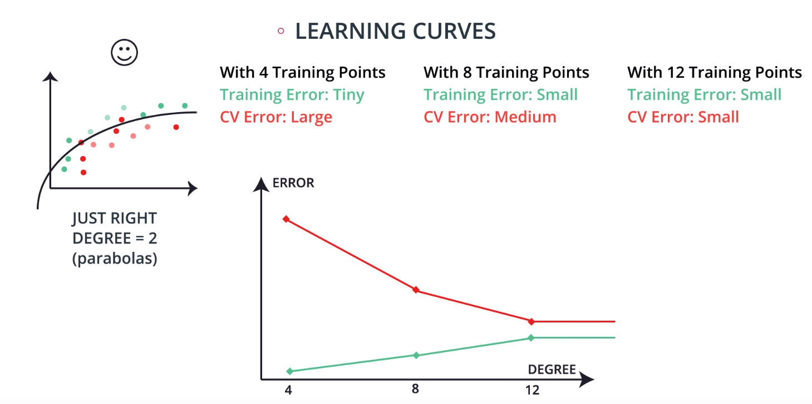

# Supervised Machine Learning
## Supervised Machine Learning
* Algorithms learn from labeled data
* Two Categories: **Classification** and **Regression**

## Linear Regression
### Absolute Trick
* Given a point p and a line y = w_1 * x + w_2

* How to change the equation:
$y' = (w_1 + p * \alpha) * x + (w_2 + 1 * \alpha), \alpha$ is learning rate.
**If the point is below the line, the intercept decreases, else, increases. If the point has a negative x-value, the slope increases, else decreases.**

### Square Trick
* Given a point p and a line $y = w_1 * x + w_2$, p' is a point on the line which $p_x = {p'}_x.$
* How to change the equation:
$y' = (w_1 + p(q - q') * \alpha) * x + (w_2 + (q - q') * \alpha), \alpha$ is learning rate. **No rules**.

### Mean Absolute Error
* Definition
$$\hat{w}_{MAE} = \frac{1}{m} \sum_{i=1}^{m} |y - \hat{y}|$$

### Mean Squared Error
* Definition
$$\hat{w}_{MSE} = \frac{1}{2m} \sum_{i=1}^{m} (y - \hat{y})^2$$

### Minimizing Error Functions
For mean squred error,
$$\hat{w}_{MSE} = \frac{1}{2m} \sum_{i=1}^{m} (y - \hat{y})^2$$

Also, we defined the prediction to be
$$\hat{y} = w_1 x + w_2$$

So to calculate the derivative of the Error with respect to $w_1$,
$$\frac{\partial Error}{\partial w_1} = \frac{\partial Error}{\partial \hat{y}} \frac{\partial \hat{y}} {\partial w_1} = -(y - \hat{y}) x$$

the derivative of the Error with respect to $w_2$,
$$\frac{\partial Error}{\partial w_2} = \frac{\partial Error}{\partial \hat{y}} \frac{\partial \hat{y}} {\partial w_2} = -(y - \hat{y})$$

### Gradient Descent
* Avoid calculating n equations with n variables using Linear Algebra, which is time consuming.

* iterate $w_i$ :
$$w_i \rightarrow w_i - \alpha \frac{\partial} {\partial w_i} Error$$

### Mini-Batch Gradient Descent
* Split your data into many small batches. Each batch, with roughly the same number of points. Then, use each batch to update your weights.

### Linear Regression Warnings
* Linear Regression Works Best When the Data is Linear
* Adding a few points that are outliers and don't fit the pattern really changes the way the model predicts.

### Polynomial Regression
* $$\hat{y} = w_1 x^3 + w_2 x^2 + w_1 x + w_0$$

### Regularization
#### 1. L1 Regularization (LASSO)
$$\hat{w}_{ridge} = arg min_w \sum_{i=1}^{n}(y_i - x_i^Tw)^2 + \lambda \|w\|_1$$
where $\lambda$ is hyperparameter and $\|w\|_1$ is L1-norm of the $w$ vector.

#### 2. L2 Regularization (Ridge)
$$\hat{w}_{ridge} = arg min_w \sum_{i=1}^{n}(y_i - x_i^Tw)^2 + \lambda \|w\|^2_2$$
where $\lambda$ is hyperparameter and $\|w\|^2_2$ is L2-norm of the $w$ vector.

#### LASSO & Ridge comparison
| L1 Regularization | L2 Regularization     |
| :------------- | :------------- |
| Computationally Inefficient (unless data is sparse)| Computationally efficient|
|Sparse Outputs| Non-Sparse Outputs|
|Feature Selection| No Feature Selection|

### Feature Scaling
#### Standardizing (the most common)
* Standardizing is completed by taking each value of your column, subtracting the mean of the column, and then dividing by the standard deviation of the column.
* Example:

$$df['height\_standard'] = \frac{df['height'] - mean(df['height'])}{std(df['height'])}$$
#### Normalizing
* With normalizing, data are scaled between 0 and 1.

$$df['height\_normal'] = \frac{df['height'] - min(df['height'])}{max(df['height']) - min(df['height'])}$$

#### When to use
1. When your algorithm uses a distance-based metric to predict. (Support Vector Machines(SVM) / K-Nearest Neighbors(KNN))
2. When you incorporate regularization. (LASSO / Ridge)

## Perceptron
### 2D:

Boundary Line:

$w_1x_1 + w_2x_2 + b = 0$

$\Rightarrow Wx + b = 0, W = (w_1, w_2), x = (x_1, x_2)$
y = 0 or 1 (label)

Prediction:
$$\hat{y} = \left\{\begin{array}{cc}
       		1, & \text{if}\ Wx + b \geqslant 0\\
       		0, & \text{if}\ Wx + b < 0
\end{array}\right.$$

### Higher Dimensions:
#### 1. 3D
Line $\rightarrow$ Plane

$w_1x_1 + w_2x_2 + w_3x_3 + b = 0$  ($Wx + b = 0$)

Prediction:
$$\hat{y} = \left\{\begin{array}{cc}
       		1, & \text{if}\ Wx + b \geqslant 0\\
       		0, & \text{if}\ Wx + b < 0
\end{array}\right.$$

#### 2. nD
Line $\rightarrow$ n-1 dimensional hyperplane
$w_1x_1 + w_2x_2 + w_3x_3 + ...+ w_nx_n + b = 0$  ($Wx + b = 0$)

Prediction:
$$\hat{y} = \left\{\begin{array}{cc}
       		1, & \text{if}\ Wx + b \geqslant 0\\
       		0, & \text{if}\ Wx + b < 0
\end{array}\right.$$

### Perceptron

* AND Perceptron

* OR Perceptron

* Perceptron Algorithm

## Decision Tree
### Entropy

#### Two-class Entropy
General Formula for entropy when the balls can be of two colors.

$$Entropy = -\frac{m}{m + n} log_2(\frac{m}{m + n}) - \frac{n}{m + n} log_2(\frac{n}{m + n})$$

#### Multi-class Entropy
$$Entropy = -p_1 log_2(p_1) - p_2 log_2(p_2) - ... - p_n log_2(p_n) = \sum_{i=1}^{n} p_i\ log_2(p_i)$$

#### Information Gain Formula
$$Information\ Gain = Entropy(Parent) - [p1 * Entropy(Child_1) + p2 * Entropy(Child_2)]$$

#### Hyperparameters for Decision Trees
##### 1. **Maximum Depth**
The maximum depth of a decision tree is simply the largest possible length between the root to a leaf. A tree of maximum length $k$ can have at most $2^k$ leaves.

##### 2. **Minimum number of samples to split**
A node must have at least `min_samples_split` samples in order to be large enough to split. If a node has fewer samples than `min_samples_split` samples, it will not be split, and the splitting process stops.

##### 2. **Minimum number of samples per leaf**
When splitting a node, one could run into the problem of having 99 samples in one of them, and 1 on the other. This will not take us too far in our process, and would be a waste of resources and time. If we want to avoid this, we can set a minimum for the number of samples we allow on each leaf.

## Naive Bayes
### Bayes Theorem
| Known | Inferred     |
| :------------- | :------------- |
| P(A)   P(R\|A)| P(A\|R)|

### Naive Bayes Algorithm
$P(A \bigcap B) = P(A) * P(B)$

$P(A | B) P(B) = P(B | A) P(A)$

$P(A|B) \propto P(B | A) P(A)$

**Accuracy** measures how often the classifier makes the correct prediction. It’s the ratio of the number of correct predictions to the total number of predictions (the number of test data points).

$\frac{number\ of\ correct\ predictions}{total\ number\ of\ predictions}$

**Precision** tells us what proportion of messages we classified as spam, actually were spam.
It is a ratio of true positives(words classified as spam, and which are actually spam) to all positives(all words classified as spam, irrespective of whether that was the correct classification), in other words it is the ratio of

`[True Positives / (True Positives + False Positives)]`

**Recall(sensitivity)** tells us what proportion of messages that actually were spam were classified by us as spam.
It is a ratio of true positives(words classified as spam, and which are actually spam) to all the words that were actually spam, in other words it is the ratio of

`[True Positives / (True Positives + False Negatives)]`

## Support Vector Machines (SVM)
### Minimizing Distances

### Error Function Intuition

### Perceptron Algorithm

### Classification Error

### Margin Error

### Margin Error Calculation
$W = (w_1, w_2), x = (x_1, x_2), Wx = w_1x_1 + w_2x_2$

We have three lines:
* $Wx + b = 1$
* $Wx + b = 0$
* $Wx + b = -1$

To calculate the distance between the first and the third, we only need to find the distance between the first two, and multiply by two.

We move these lines so that $Wx + b = 0$ is translated to $Wx = 0$

Find the intersect: assume the intersect is $(p,q)$
$$\hat{y} = \left\{\begin{array}{cc}
       		w_1p + w_2q = 1, \\
       		(p, q) = k(w_1, w_2),
\end{array}\right.$$

$\Rightarrow k({w_1}^2 + {w_2}^2) = 1$
$\Rightarrow k = \frac{1}{{w_1}^2 + {w_2}^2} = \frac{1}{|W|^2}$

Therefore, the blue point represents the vector $\frac{(w_1, w_2)}{|W|^2}$

Therefore the total distance is $\frac{2}{|W|}$

### C parameter
Error = C * Classification Error + Margin Error

### Polynomial Kernel
#### Kernel Trick
How to use SVM to separate these points?

Adding a y axis

### RBF Kernel

Find a line to separate red and blue points

add radial basis functions for each point

How tall is the mountain at that point?

Hyperparameter $\gamma$
2D:

3D:

What is $\gamma$?

Normal Distribution: $y = \frac{1}{\sigma \sqrt{2 \pi}} e^{-\frac{(x - \mu) ^ 2}{2 \sigma^2}}$
$\gamma = \frac{1}{2 \sigma ^ 2}$

## Ensemble Methods
### Ensemble
Why?

Two competing variables in finding a well fitting machine learning model: Bias and Variance

* Bias: an error from erroneous assumptions in the learning algorithm. High bias can cause an algorithm to miss the relevant relations between features and target outputs (underfitting).

* Variance: an error from sensitivity to small fluctuations in the training set. High variance can cause an algorithm to model the random noise in the training data, rather than the intended outputs (overfitting).

The model will perform better by meeting in the middle in terms of bias and variance.

Two ways:

* **Bootstrap the data** - sampling the data with replacement and fitting your algorithm to the sampled data.

* **Subset the features** - in each split of a decision tree or with each algorithm used an ensemble only a subset of the total possible features are used.

### Random Forests
Train Data:

Pick subsets from Train Data:

$1^{st} subset:$

$2^{nd} subset:$

$3^{rd} subset:$

Combine results:

### AdaBoost

Find a line to maximize accuracy, and punish the misclassified points more

The next step is trying to clssify these points right, so that the accuracy will be the maximum.

Voting:

### Weighing the data(AdaBoost)

First model

### Weighing the models(AdaBoost)

$weight = ln (\frac{accuracy}{1 - accuracy})$

### Combining the models

## Model Evaluation Metrics
### Confusion Matrix
* **Type 1 Error** (Error of the first kind, or False Positive): In the medical example, this is when we misdiagnose a healthy patient as sick.

* **Type 2 Error** (Error of the second kind, or False Negative): In the medical example, this is when we misdiagnose a sick patient as healthy.

* Accuracy:

$Accuracy = \frac{True Positive + False Negative}{overall}$

* Recall
False Negative is important
$Recall =  \frac{True Positive}{True Positive + True Negative}$

* Precision
False positive is important
$Precision =  \frac{True Positive}{False Positive + True Positive}$

### F1 Score(Harmonic Mean)

$F1 Score = 2 \frac{Precision * Recall}{Precision + Recall}$

### $F_{\beta}\ Score$
$F1 Score = (1 + \beta^2) \frac{Precision * Recall}{\beta^2 * Precision + Recall}$

if $\beta = 0,$ we get Precision

if $\beta = \infty,$ we get Recall

### Roc Curve

$True Positive Rate = \frac{True\ Positives}{All\ Positives}$

$False Positive Rate = \frac{False\ Positives}{All\ Negatives}$

### Regression Metrics

R2 Score = $1 - \frac{error_{linear\ regression}}{error_{simple}}$

## Training and Tuning
### Type of Errors
#### Underfitting
* **Does not do well in the training set**
* **Error due to bias**

#### Overfitting
* **Does well in the training set**, but it tends to memorize it instead of learning the characteristics of it.
* **Error due to variance**

#### Summary

### Cross Validation
#### Model Complexity Graph

**Important: This is not allowed because we use test data to train our model.**

Introduce Cross Validation

### K-fold Cross Validation

### Learning Curves

