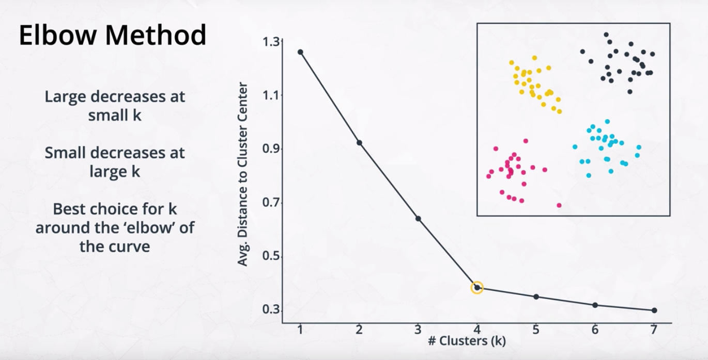

# Unsupervised Learning
## Outline
### 1. Unsupervised learning is all about understanding how to group our data when we either
* Do not have a label to predict.
* Are not trying to predict a label
### 2. Topics
* Clustering
* Hierarchical and Density Based Clustering
* Gaussian Mixture Models and Cluster Validation
* Principal Component Analysis
*  Random Projection and Independent Component Analysis

## K-Means

Good for **circular** or **spherical** or **hyper-spherical in higher dimensions**.

##
